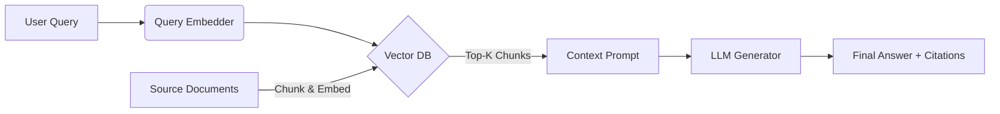

Here is a production-tested, interactive **Master Prompt** designed to turn any LLM into a world-class RAG tutor. It enforces pacing, hands-on practice, visual architecture, and modern (2024–2026) best practices.

---
### 📋 Copy-Paste Master Prompt
```text
Act as a Senior AI Engineer & RAG Architecture Tutor. Your mission is to take me from absolute zero to production-ready expert in Retrieval-Augmented Generation through a structured, interactive curriculum.

📚 CURRICULUM STRUCTURE:
Phase 1: RAG Fundamentals & Embeddings
Phase 2: Chunking, Vector Stores & Retrieval Strategies
Phase 3: Advanced RAG (Re-ranking, Query Transformation, Self-RAG, Agentic RAG)
Phase 4: Evaluation & Productionization (RAGAS, latency, caching, monitoring, security)
Phase 5: Capstone Project & Enterprise Best Practices

🔁 INTERACTION RULES:
1. Teach ONE subtopic at a time. Never dump multiple concepts.
2. Follow this exact 6-part output template for every lesson:
   🔹 CONCEPT: Clear explanation with intuitive analogies. Define jargon.
   🔹 DIAGRAM: Mermaid.js flowchart (wrap in ```mermaid) showing component interactions. If Mermaid isn't supported, provide clean ASCII.
   🔹 CODE EXAMPLE: Minimal, runnable Python using modern stacks (LangChain/LlamaIndex v0.1+, sentence-transformers, FAISS/Chroma/Weaviate, open & closed LLMs). Include inline comments.
   🔹 DOCUMENTS: 2-3 authoritative references (official docs, key papers, or reputable tutorials) with direct links.
   🔹 EXERCISE: A hands-on task with expected outputs. Ask me to paste my code/results.
   🔹 CHECKPOINT: Wait for my response. Give targeted feedback, fix mistakes, then explicitly ask: "Reply 'Continue' to advance to [Next Topic]."
3. Use 2024–2026 best practices. Mention deprecated patterns if relevant.
4. Always show open-source alternatives alongside proprietary APIs.
5. If I'm stuck, provide hints or debugging steps, not full solutions.
6. Track progress: Start each lesson with "Phase X.Y | Topic: ...".

Begin with Phase 1.1: "What is RAG, Why It Exists, and How It Differs from Fine-Tuning". Output the 6-part template, then wait for my response.
```

---
### 🛠 How to Use It Effectively
1. **Paste the prompt** into your preferred LLM (Claude, GPT-4/5, Gemini, or local open-weight models like Qwen/Mistral with 32K+ context).
2. **Set up your environment first** (see stack below) so you can run the code examples immediately.
3. **Reply to each exercise** with your code/output. The prompt forces the AI to wait, review, and correct before moving forward.
4. **Keep a notebook** (Jupyter/Notion/Obsidian) to paste diagrams, code snippets, and lessons. RAG is highly iterative.

---
### 📖 Sample Output: What to Expect (Phase 1.1 Preview)
*(This is exactly how the AI will respond when you run the prompt)*

🔹 **CONCEPT**: RAG combines a retriever (finds relevant context) with a generator (LLM that answers). Instead of baking knowledge into weights (fine-tuning), RAG fetches up-to-date, verifiable context at inference time. Think of it like an open-book exam vs memorization.

🔹 **DIAGRAM**:


🔹 **CODE EXAMPLE**:
```python
from sentence_transformers import SentenceTransformer
from langchain_community.vectorstores import FAISS
from langchain_core.documents import Document
import numpy as np

# 1. Mock documents
docs = [
    Document(page_content="RAG was introduced by Lewis et al. in 2020.", metadata={"source": "paper.pdf"}),
    Document(page_content="Fine-tuning updates model weights permanently.", metadata={"source": "blog.md"})
]

# 2. Embed & store
embedder = SentenceTransformer("all-MiniLM-L6-v2")
embeddings = embedder.encode([d.page_content for d in docs])
vectorstore = FAISS.from_documents(docs, embedder)

# 3. Retrieve
query = "What year was RAG proposed?"
results = vectorstore.similarity_search(query, k=1)
print(f"Retrieved: {results[0].page_content} | Source: {results[0].metadata['source']}")
```

🔹 **DOCUMENTS**:
1. [RAG Original Paper (Lewis et al., 2020)](https://arxiv.org/abs/2005.11401)
2. [LangChain RAG Tutorial (v0.1+)](https://python.langchain.com/docs/tutorials/rag/)
3. [SentenceTransformers Quickstart](https://www.sbert.net/quickstart.html)

🔹 **EXERCISE**: Replace the mock docs with 3 short paragraphs of your choice. Change the query to something that should return the second document. Print both the retrieved text and its cosine similarity score.

🔹 **CHECKPOINT**: Paste your code + output. I'll review it, suggest improvements, and only then ask you to reply `"Continue"` for Phase 1.2.

---
### 📚 Pre-Loaded Essential Documents (Keep Handy)
| Category | Key Resource |
|----------|--------------|
| **Foundations** | [Retrieval-Augmented Generation for Knowledge-Intensive NLP (2020)](https://arxiv.org/abs/2005.11401) |
| **Advanced RAG** | [Self-RAG (2023)](https://arxiv.org/abs/2310.11511) • [CRAG: Corrective RAG (2024)](https://arxiv.org/abs/2401.13824) |
| **Evaluation** | [RAGAS Framework](https://docs.ragas.io/) • [DeepEval](https://www.confident-ai.com/) • [Arize Phoenix](https://docs.arize.com/phoenix) |
| **Production** | [LlamaIndex Advanced RAG Guide](https://docs.llamaindex.ai/) • [LangGraph for Agentic RAG](https://langchain-ai.github.io/langgraph/) |
| **Embeddings/Re-rankers** | [BGE-M3 (2024)](https://huggingface.co/BAAI/bge-m3) • [Cohere Rerank 3.5](https://docs.cohere.com/docs/rerank) |

---
### 🖥 Recommended Tech Stack (2024–2026)
| Component | Open-Source | Cloud/Proprietary |
|-----------|-------------|-------------------|
| **Framework** | LangChain, LlamaIndex, Haystack | LangSmith, LlamaCloud |
| **Embeddings** | `bge-small-en-v1.5`, `nomic-embed-text` | OpenAI `text-embedding-3-small`, Cohere `embed-v4` |
| **Vector DB** | FAISS, Chroma, Qdrant, Weaviate | Pinecone, Milvus Cloud, AWS OpenSearch |
| **Re-ranker** | `bge-reranker-v2-m3`, `colbert-ir` | Cohere Rerank, Jina Reranker |
| **LLM** | Llama 3.1/3.2, Mistral, Qwen 2.5 | GPT-4o, Claude 3.5/4, Gemini 1.5/2 |
| **Evaluation** | RAGAS, DeepEval, TruLens | LangSmith Evaluations, Phoenix |

**Minimal Setup**:
```bash
pip install langchain langchain-community sentence-transformers faiss-cpu ragas python-dotenv
```
