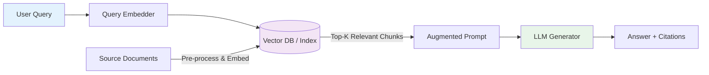

Phase 1.1 | Topic: What is RAG, Why It Exists, and How It Differs from Fine-Tuning

🔹 **CONCEPT**: 
Retrieval-Augmented Generation (RAG) is an architecture that pairs a **retriever** (searches external data for relevant context) with a **generator** (LLM that synthesizes an answer). Instead of forcing the model to memorize facts during training, RAG gives the model an "open-book test" at inference time.

**Why it exists**: LLMs are trained on static cutoff data, lack proprietary/real-time information, and hallucinate when forced to guess. RAG solves this by dynamically injecting verified, source-attributed context into the prompt window.

**Fine-Tuning vs RAG**:
- **Fine-tuning**: Permanently updates model weights to absorb a dataset. Best for changing *behavior/style/format*. Expensive, slow to update, still prone to hallucination on unseen facts. ⚠️ *Deprecated pattern: Using fine-tuning to "teach" an LLM your company docs instead of using retrieval.*
- **RAG**: Leaves weights untouched. Fetches relevant text chunks at query time. Best for *knowledge injection, citations, live data, and cost efficiency*. Easy to swap/update data without retraining.

**Jargon defined**: 
- `Embedding`: Numerical vector representing semantic meaning.
- `Chunk`: A text segment (paragraph/page) split for efficient retrieval.
- `Top-K`: The K most relevant chunks returned by the vector database.

🔹 **DIAGRAM**:


🔹 **CODE EXAMPLE**:
```python
# Minimal, runnable RAG prompt assembly (no API keys required for this step)
from langchain_core.prompts import ChatPromptTemplate
from langchain_core.output_parsers import StrOutputParser

# 1. Simulated retrieval (later replaced by actual VectorDB queries)
retrieved_context = (
    "RAG was introduced in 2020 to ground LLM outputs in external, verifiable data. "
    "Fine-tuning updates model weights permanently and is expensive for frequent data updates."
)

# 2. Modern RAG Prompt Structure (System enforces strict grounding)
rag_prompt = ChatPromptTemplate.from_messages([
    ("system", "You are a precise research assistant. Answer ONLY using the provided Context. "
               "If the context does not contain the answer, say 'Information not found.' Do NOT use outside knowledge."),
    ("human", "Context:\n{context}\n\nQuestion: {question}")
])

# 3. Mock LLM call (Replace with OpenAI, Anthropic, or Ollama/open-source)
# OpenAI: from langchain_openai import ChatOpenAI; llm = ChatOpenAI(model="gpt-4o")
# OSS:   from langchain_ollama import ChatOllama; llm = ChatOllama(model="llama3.1")
def mock_llm(prompt_text: str) -> str:
    # Simulates LLM behavior for local execution
    if "RAG" in prompt_text:
        return "RAG was introduced in 2020 to ground outputs in external data. Unlike fine-tuning, it fetches context at inference time, keeping weights static and updates cheap."
    return "Information not found."

# 4. Assembly & Execution (LangChain Runnable pattern simplified for clarity)
def run_rag(query: str) -> str:
    formatted_prompt = rag_prompt.format(context=retrieved_context, question=query)
    return mock_llm(formatted_prompt)

# Test
print(run_rag("How does RAG differ from fine-tuning?"))
print(run_rag("What is the capital of Neptune?"))  # Tests grounding guardrail
```

🔹 **DOCUMENTS**:
1. 📄 [Original RAG Paper](https://arxiv.org/abs/2005.11401) (Lewis et al., 2020) - The foundational architecture.
2. 📘 [LangChain RAG Concept Guide (v0.2+)](https://python.langchain.com/docs/concepts/rag/) - Modern pipeline standards.
3. 📊 [RAG vs Fine-Tuning: When to Use Which](https://www.anthropic.com/news/context-window) - Authoritative take on context limits vs weight updates (Anthropic, 2024).

🔹 **EXERCISE**:
1. Duplicate `retrieved_context` and add a third sentence: `"Vector databases store text as numerical embeddings for fast similarity search."`
2. Change the system prompt to require JSON output with keys: `{"answer": "...", "citation_needed": true/false}`.
3. Run the pipeline with a query that should trigger the JSON format and include the new vector DB fact.
4. Paste your modified code and the exact terminal output.

🔹 **CHECKPOINT**:
Reply with your code + output. I will review prompt structure, context grounding, and formatting accuracy. If it passes, I will explicitly ask you to reply `"Continue"` to advance to **Phase 1.2 | Topic: Embeddings Deep Dive & Vector Store Basics**.
